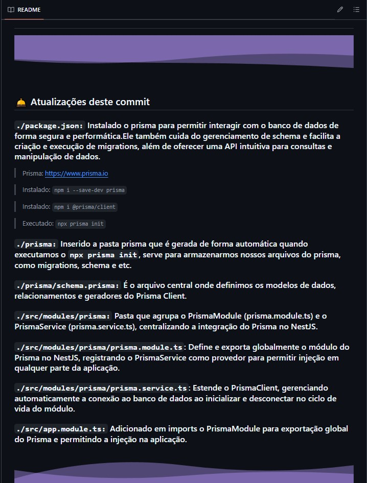
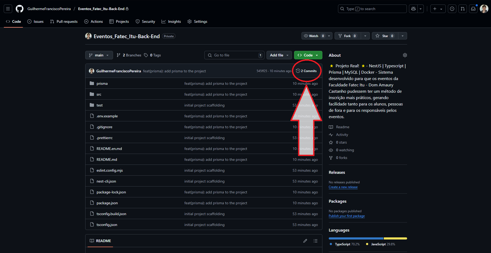
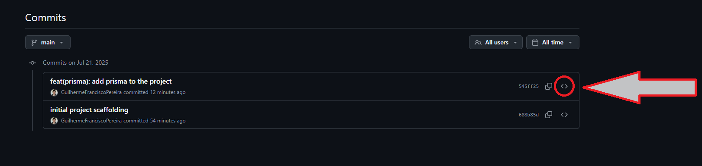
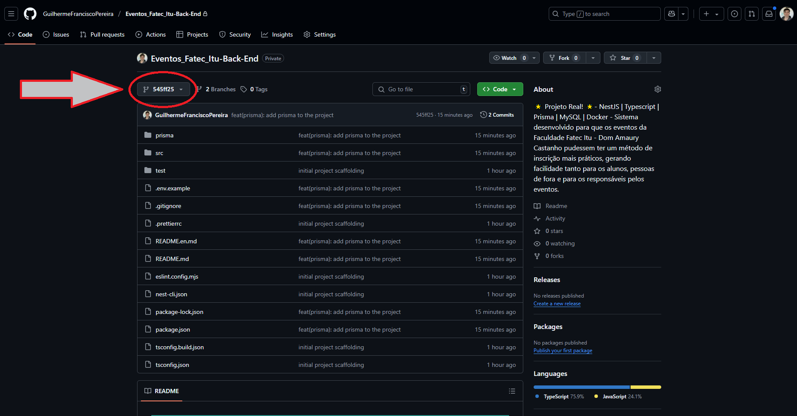
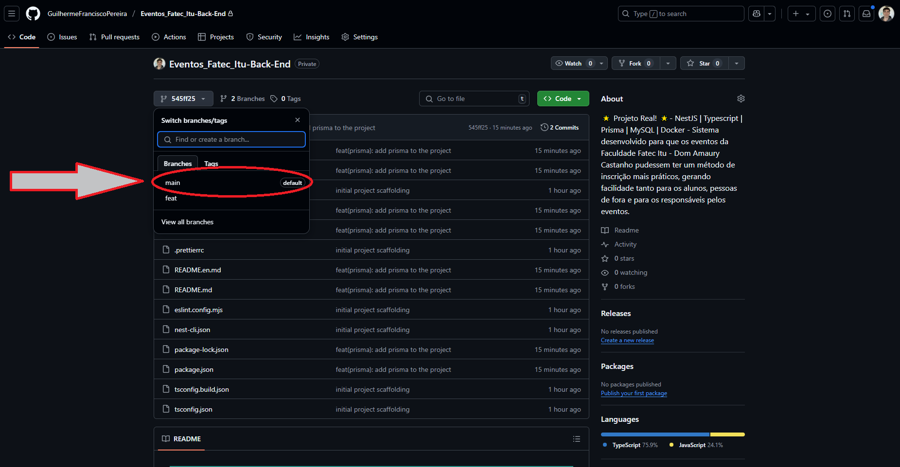

# 📅 System - Fatec Itu 📅

<p align="left">
<a href="./README.md">

</a>
</p>

## ⭐ Back-End Repository

## 📌 About the project

### This system was developed so that events at Fatec Itu - Dom Amaury College can be streamed. Castanho could have a more practical registration method, making it easier for students, outsiders, and event organizers. Clearly, this system is also used by event organizers for management, monitoring, etc.

### 👥 This system is being created by: Guilherme Francisco Pereira as a final project development / Real system

### ✨ Interesting fact!! This is the only student-developed system that is implemented and used by the college, both by students and professors, coordinators, and more!


##


## 🛎️ Updates to this commit

### `./src/modules/categories/categories.service.ts:` Fixed the `findAllPublic` function where it correctly only brought categories that had at least 1 event, however, if the event had the maximum number of participants and it was not possible to see it on the front, it still brought the category to the front filter, fixed that.


##

## 🖥 Technologies Used
<div align='center'>


</div>

## Versions used: 
    - Nest: 11.0.7 
    - Typescript: 5.7.3
    - Prisma: 6.12.0
    - MySQL: 8.0.42
    - Docker: 28.3.2

## 🙋🏻‍♂ How can I locate myself in the project?

### All project source code files are in: `./src` and E2E tests are in: `./test`

## 🛈 How the project is structured

- `./prisma:` Prisma allows you to interact with the database securely and efficiently. It also handles schema management and facilitates the creation and execution of migrations, in addition to offering an intuitive API for queries and data manipulation.
    - `schema.prisma:` This is the central file where we define the Prisma Client's data models, relationships, and generators.

- `./src/app.module.ts`: Root module that declares/imports the application's other modules, controllers, and providers.
- `./src/main.ts`: Application entry point, where Nest is initialized and configured.

- `./src/assets:` directory to organize additional static resources.
    - `readme:` Folder that will store our photos for use in the documentation ( README )

- `./src/decorators:` Folder for custom decorators.
    - `public.decorator.ts:` Defines a decorator to allow public routes to unauthenticated users.
    - `roles.decorator.ts:` Defines a decorator to indicate which user profiles are allowed to access each endpoint.

- `./src/guards:` Folder for authentication and authorization guards.
    - `jwt-auth.guard.ts:` Ensures that only requests authenticated with a valid JWT token are accepted and populates user data in the request.
    - `roles.guard.ts:` Controls access based on the user profile, allowing unrestricted endpoints and blocking them when the profile does not match the permitted ones.

- `./src/modules:` The modules folder contains all the application modules, each in its own directory to keep logic, controllers, and providers well-organized and decoupled, all then imported by the root module (AppModule).
    - `auth:` Module dedicated to the entire user authentication and authorization flow.
        - `dto:` Folder containing Data Transfer Objects that define the input and output format of authentication requests. In short, it's our "Typing." - `auth.controller.ts:` Exposes the endpoints for me, register, logout, request-login, login, request-reset-password, and reset-password, manages access cookies, refresh, and 2FA.
        - `auth.controller.spec.ts:` Covers controller integration tests, validating scenarios for valid and expired tokens, registration, logout, login with 2FA, and password reset.
        - `auth.service.ts:` Encapsulates all authentication business logic—user registration with password hashing, access token generation and verification, refresh and 2FA, sending emails, and clearing expired tokens.
        - `auth.service.spec.ts:` Tests the authentication service flows, ensuring correct behavior in cases of conflict, invalid credentials, token generation, revocation, and renewal of refresh tokens.
        - `auth.module.ts:` Configures the authentication module, imports PrismaModule, ConfigModule, JwtModule with RSA keys loaded from environment variables, and registers AuthService, JwtStrategy, and EmailService
        - `jwt.strategy.ts:` Extracts the JWT from the access cookie, validates its signature and expiration using the public key, and provides user data (ID, email, profile) to the guards

    - `carousel:` Package dedicated to the complete management of image collections displayed in a carousel in the system, encompassing all CRUD operations and photo presentation.
        - `dto:` Directory containing the Data Transfer Objects (CreateCarouselDto, UpdateCarouselDto, and CarouselResponseDto) responsible for defining the format of the input and output data in carousel requests.
        - `carousel.controller.ts:` Defines the REST endpoints for listing (GET /carousel), creating (POST /carousel/post), updating (PATCH /carousel/patch/:id), updating only the isActive field (PATCH patch/toggle/:id), and removing (DELETE /carousel/delete/:id) image items in the carousel. - `carousel.controller.spec.ts:` Controller integration tests, ensuring that each route correctly forwards calls to the CarouselService and returns the expected HTTP codes.
        - `carousel.service.ts:` Implements the carousel's business logic — interacts with PrismaClient to retrieve, insert, modify, and delete records in the Carousel table, and integrates with the Cloudinary module to save and delete images in the Cloudinary.
        - `carousel.service.spec.ts:` Unit test suite for the service, covering success and failure scenarios for each method exposed by CarouselService.
        - `carousel.module.ts:` Carousel module configuration file, importing PrismaModule, MulterModule, and CloudinaryModule, registering CarouselService and CarouselController in the NestJS context.

    - `categories:` Package dedicated to complete category management, encompassing all CRUD operations.
        - `dto:` Directory containing the Data Transfer Objects (CreateCategoryDto, UpdateCategoryDto, and CategoryResponseDto) responsible for modeling the input and output data in category requests.
        - `categories.controller.ts:` Defines the REST endpoints for listing (GET /categories), creating (POST /categories), updating (PATCH /categories/:id), and deleting (DELETE /categories/:id) categories.
        - `categories.controller.spec.ts:` Controller integration tests, ensuring that each route correctly forwards calls to the CategoriesService and returns the expected HTTP codes. - `categories.service.ts:` Implements the business logic of categories — interacts with PrismaClient to search for, insert, modify, and delete records in the Category table.
        - `categories.service.spec.ts:` Unit test suite for the service, covering success and failure scenarios for each method exposed by CategoriesService.
        - `categories.module.ts:` Assembly file for the categories module, importing PrismaModule and registering CategoriesService and CategoriesController in the NestJS context.
    
    - `certificates:` Module responsible for storing and exporting the logic for sending certificates to students who attended the event.
        - `certificates.module.ts:` Imports ScheduleModule.forRoot() and PrismaModule and exports the service for use elsewhere in the code.
        - `certificates.service.ts:` All the logic for sending certificates to students who attended the previous day's events.
    
    - `cloudinary:` Exports the option to insert or remove photos from Cloudinary (free service for saving images, I recommend: https://cloudinary.com)
        - `cloudinary.module.ts:` Imports our provider and service and exports the service for use elsewhere in the code
        - `cloudinary.provider.ts:` Configures the connection to Cloudinary
        - `cloudinary.service.ts:` Exports the functions for uploading and deleting a photo

    - `common:` We concentrate functionality shared by multiple modules; this is where components that don't belong to a specific domain are stored.
        - `csrf.controller.ts:` Exposes an endpoint to obtain the user's CSRF token, ensuring that each call actually comes from the legitimate application and not a malicious website, thus preventing CSRF.

    - `events:` Package dedicated to complete event management, encompassing CRUD operations, image uploads, and date and time availability queries.
        - `dto:` Directory containing Data Transfer Objects (CreateEventDto, UpdateEventDto, and EventResponseDto) responsible for defining the format of input and output data in event requests.
       - `events.controller.ts:` Defines the REST endpoints for listing (GET /events), searching by ID (GET /events/:id), creation (POST /events/create), partial update (PATCH /events/patch/:id), removal (DELETE /events/delete/:id), date availability (GET /events/availability/dates) and time availability (GET /events/availability/times). All protected by JwtAuthGuard and RolesGuard, with @Roles decorator for ADMIN and COORDINATOR profiles, file interception for image upload and appropriate HTTP codes (201 for creation, 200 for removal), only the route (GET /publicAllEvents) does not require authentication, this route is used to show events to unauthenticated users.
        - `events.service.ts:` Implements all event business logic — interacts with PrismaClient for CRUD operations, validates schedule conflicts to avoid overlap, uses CloudinaryService for image upload and deletion, and dynamically calculates free date and time slots based on the specified location and date.
        - `events.service.spec.ts:` Unit test suite for EventsService, covering creation scenarios without a file, detecting schedule overlaps, successful creation with image upload, updating with and without a new file (including deletion and upload to Cloudinary), calculating availability for times and dates for different locations, deleting an event with image deletion, and handling ConflictException and NotFoundException exceptions. - `events.module.ts:` Events module configuration file, importing PrismaModule and CloudinaryModule, and registering EventsService and EventsController in the NestJS context.
    
    - `participants:` Module dedicated to the complete flow of participant registration and attendance control in events
        - `dto:` Contains the Data Transfer Objects (CreateParticipantDto, UpdateParticipantDto, and ParticipantResponseDto) that define the form of input and output data in participant operations
        - `participants.controller.ts:` Exposes the registration (POST /participants/create) and attendance update (PATCH /participants/patch/:id) endpoints, applies JwtAuthGuard and RolesGuard for ADMIN, COORDINATOR, and AUXILIARY, and marks the creation route as public
        - `participants.controller.spec.ts:` Integration test suite that validates public registration, access attempts without authentication, and authorized attendance updates
        - `participants.service.ts:` Encapsulates all registration and attendance business logic, including checking for duplicate email and RA per event, validation institutional domain, incrementing the participant counter, persisting registration, and sending confirmation emails
        - `participants.service.spec.ts:` Unit tests the service, covering email/RA conflict scenarios, participant creation, updating attendance, and sending confirmation emails
        - `participants.module.ts:` Configures the participants module by importing PrismaModule, declaring ParticipantsService and EmailService as providers, and registering ParticipantsController as the controller

    - `prisma:` Bundles the PrismaModule (prisma.module.ts) and PrismaService (prisma.service.ts), centralizing Prisma integration in NestJS.
        - `prisma.module.ts`: Defines and globally exports the Prisma module in NestJS, registering the PrismaService as a provider to allow injection into any part of the application.
        - `prisma.service.ts`: Extends PrismaClient, automatically managing the database connection during initialization and disconnection during the module lifecycle.
    - `users:` Module responsible for all user CRUD operations.
        - `dto:` Folder with Data Transfer Objects that define the input and output format of user requests. In short, it's our "Typing".
        - `users.controller.ts`: Exposes the get, post, patch, and delete endpoints for the user CRUD.
        - `users.controller.spec.ts`: Controller integration tests, ensuring that each route correctly invokes the UsersService.
        `users.service.ts`: Business logic for the users module, handling requests that arrive on the controller routes, searching for all users, registering, updating, and deleting them.
        - `users.service.spec.ts`: Unit tests for the UsersService, covering success and error scenarios for each method. - `users.module.ts:` Configures the UsersModule, importing PrismaModule and ConfigModule, and registering UsersService and UsersController.
        - `./src/services:` Brings together injectable classes that encapsulate business logic, utilities, and external integrations.
          
- `./src/services`: Brings together injectable classes that encapsulate business logic, utilities, and external integrations.
    - `email.service.ts:` We have the configurations for sending emails and the send method that we will actually use to send emails.

- `./Dockerfile:` Defines how the application will be packaged into a Docker image.

- `./dockerignore:` Prevents unnecessary files (node_modules, build, etc.) from being included in the image.

- `./docker-compose.yml:` Orchestrates services (Nest app, MySQL database) in a single command, taking care of networking, volumes, and environment variables.

- `./test/` Directory dedicated to end-to-end (e2e) tests:
    - `app.e2e-spec.ts`: Our e2e tests to validate endpoints and main API flows ensure that scenarios work as expected, testing success flows and error flows, such as validation, authorization, etc.
    - `jest.e2e-json`: Jest configuration file for running e2e tests (defining recognized file extensions, starting point for test searches, transforms, etc.)

## ❔ How do I run the project on my machine?

- First of all, you need to have Git installed on your computer. Git is a tool that allows you to clone and manage code repositories.
- Windows: Download Git <a href="https://git-scm.com/download/win" target="_blank">here</a> and follow the installation instructions. - macOS: You can install Git <a href="https://git-scm.com/download/mac" target="_blank">here</a> or using Homebrew with the brew install git command:
    ```bash
    brew install git
    ```

- Linux: Use your distribution's package manager, for example, for Debian/Ubuntu:
    ```bash
    sudo apt install git
    ```

- Open a terminal (on Windows, you can use Git Bash, which is installed along with Git).

- Navigate to the directory where you want to store the project.

- Run the command to clone the repository:
    ```bash
    git clone https://github.com/GuilhermeFranciscoPereira/Eventos_Fatec_Itu-Back-End.git
    ```

- After cloning the repository, navigate to the project folder.
    ```bash
    cd Eventos_Fatec_Itu-Back-End.git
    ```

- Now you can open the project files with your preferred text editor or IDE. Example:
    ```bash
    code .
    ```

- 🚨 Don't forget that to avoid errors in the code when cloning it, you must run the command below: 🚨
    ```bash
    npm i
    ```

- 🚨 To avoid errors, you must also update Prisma for your database. To do this, run the command below before running the code! 🚨
    ```bash
    npx prisma generate
    ```

- Once you have the project on your machine, open the website. To do this, follow the steps below:
    - Remember to create the .env file based on everything contained in the file: `.env.example`
    - Open the terminal and write the code below to start the website:
        ```bash
        npm run start:dev
        ```

##

## 🐳 Docker Commands

### After the 3 files, we generate the Docker image and run it:
``` bash
docker-compose up --build -d
```

### This will:
- Start the MySQL container (db)
- Launch Nest (app)

### Check that the container is actually up and has the port mapped

```bash
docker-compose ps
```

### Open the port that appears, for example:

```bash
http://localhost:xxxx
```

### To restart the backend when changing the code:

```bash
docker-compose restart backend_events-fatec-itu
```

### To restart the database when changing the code:

```bash
docker-compose restart db_events-fatec-itu
```

### To restart everything at once:

```bash
docker-compose restart
```

### Stop only the db

```bash
docker-compose stop db_events-fatec-itu
```

### Stop only the backend

```bash
docker-compose stop backend_events-fatec-itu
```

### If you want to remove the container (in addition to stopping it), use rm:

```bash
docker-compose rm db
```

```bash
docker-compose rm backend
```
### When you want to stop everything at once:

```bash
docker-compose down -v
```

### If you want the 'hot reload' to always update with changes, you can change the `docker-compose.yml` and add:

```bash 
volumes: 
- ./:/app 
- /app/node_modules 
command: npm run start:dev
```

##

## 🧪 How to run unit and End-To-End (e2e) tests?

### Unit tests: you have two options: run all unit tests at once or one at a time.

- `All unit tests at once:`

```bash
npm run test
```

- `Testing a specific unit test:` Command: `npx jest` followed by the module name, for example, `users`, and the file name, for example, `users.service.spec.ts`, always respecting the folder hierarchy. If the modules are inside a modules folder, this should be included after src.
    - It should look like this:
    ```bash
    npx jest src/modules/users/users.service.spec.ts
    ```

### End-to-End (e2e) Tests:

- To run e2e tests, you just need to write one command, and it will perform the entire application test with success and failure cases:
    ```bash
    npm run test:e2e
    ```
##

## ⚠️ Important information about the project ⚠️

### 📝 All project commits have a detailed readme detailing what was done in that commit, as shown in the example image below. So if you want to see the code creation process, scroll through the commits and see the information! Example:

##

##

### ❔ How to do this?

### 👇🏻 To see the creation process and what was done in each commit, follow these steps:

##

### 1 - In this same tab you're in, scroll up until you find the circled spot in the photo below below the green button and then click on it.


##

### 2 - On the right side of the commits, you'll find a <> symbol, as circled in the photo below. Click on this symbol and you'll find the code at that time and the detailed readme for that moment! 

##

### 3 - After finding everything you need, if you want to return to the current commit, click where the image below is circled:


##

### 4 - Then click on main (where it is circled in the image below) and you will return to the last commit made!


##

## 🎉 That's it! This is Fatec Itu's system for events. If you have any questions, If you have any questions or would like to ask me anything directly, you can contact me through my LinkedIn:
> My LinkedIn link: <a href="https://www.linkedin.com/in/guilherme-francisco-pereira-4a3867283" target="_blank">https://www.linkedin.com/in/guilherme-francisco-pereira-4a3867283</a>

### 🚀 Thank you for your attention and I hope you enjoyed what you saw here. How about checking out my other repositories now? 👋🏻

#

### ❤️ Credits:

#### Primary credits to Fatec Itu for providing its name and using the system in its environment! 
> <a href="https://fatecitu.cps.sp.gov.br" target="_blank">https://fatecitu.cps.sp.gov.br</a>

#### Credits to Cloudinary for using the services:
> <a href="https://cloudinary.com" target="_blank">https://cloudinary.com</a>

#### Emoji credits:
> <a href="https://emojipedia.org" target="_blank">https://emojipedia.org</a>

- #### Badge credits:
> <a href="https://shields.io" target="_blank">https://shields.io</a>