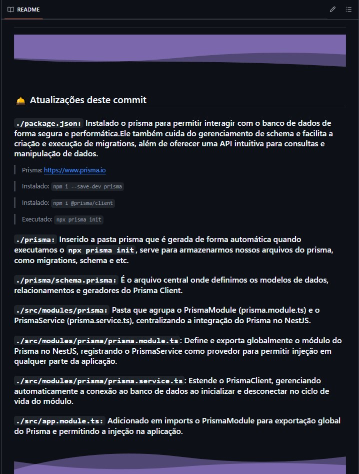
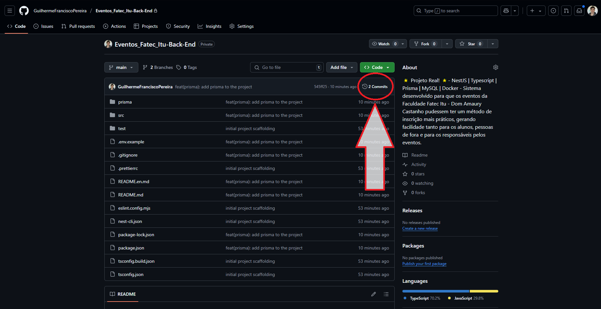
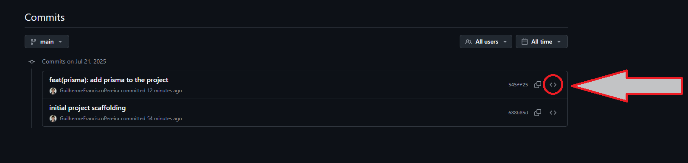
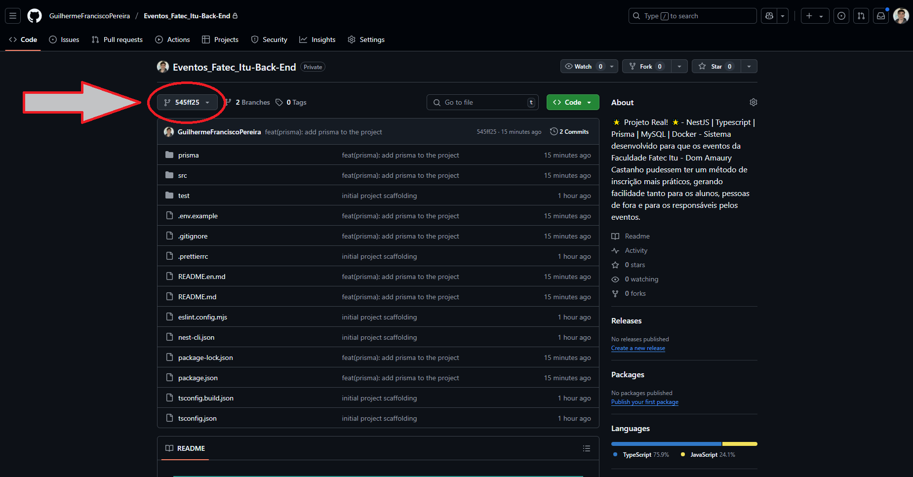
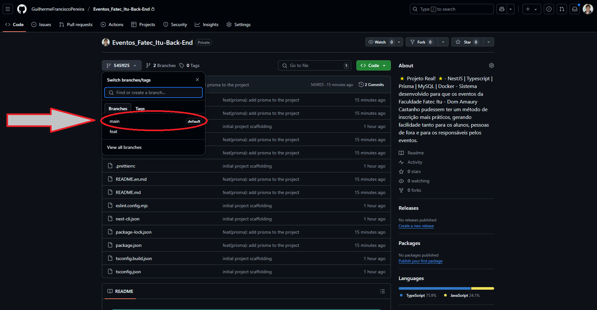

# 📅 Sistema - Fatec Itu 📅

<p align="left">
  <a href="./README.en.md">
    
  </a>
</p>

## ⭐ Repositório Back-End

## 📌 Sobre o projeto

### Este sistema foi desenvolvido para tornar as inscrições nos eventos da Faculdade Fatec Itu - Dom Amaury Castanho mais práticas, facilitando o processo tanto para alunos quanto para participantes externos. Além disso, também é utilizado por coordenadores e organizadores para o gerenciamento dos eventos, possibilitando o controle de participantes, a automação na emissão de certificados válidos e outras funcionalidades que otimizam a administração.

### 👥 O sistema está sendo desenvolvido por Guilherme Francisco Pereira como parte do Trabalho de Conclusão de Curso (TCC), com aplicação real e utilização prática.

### ✨ Fato interessante: este é um dos sistemas desenvolvidos exclusivamente por alunos que já está implantado e sendo utilizado ativamente pela faculdade, beneficiando alunos, professores, coordenadores e demais envolvidos!


##


## 🛎️ Atualizações deste commit

### `./README:` Reescrito o conteúdo da seção (📌 Sobre o projeto) desta documentação


##

## 🖥 Tecnologias Utilizadas
<div align='center'>


</div>

## Versões utilizadas:
    - Nest: 11.0.7
    - Typescript: 5.7.3
    - Prisma: 6.12.0
    - MySQL: 8.0.42
    - Docker: 28.3.2

## 🙋🏻‍♂ Como me localizar no projeto?

### Todos os arquivos de código fonte do projeto estão em: `./src` e os testes E2E estão em: `./test`

## 🛈 Como o projeto está estruturado

- `./prisma:` O prisma permite interagir com o banco de dados de forma segura e performática.Ele também cuida do gerenciamento de schema e facilita a criação e execução de migrations, além de oferecer uma API intuitiva para consultas e manipulação de dados.
  - `schema.prisma:` É o arquivo central onde definimos os modelos de dados, relacionamentos e geradores do Prisma Client.

- `./src/app.module.ts`: Módulo raiz que declara/importa os demais módulos, controladores e provedores da aplicação.  
- `./src/main.ts`: Ponto de entrada da aplicação, aqui o Nest é inicializado e configurado.

- `./src/assets:` diretório para organizar recursos estáticos adicionais.
  - `readme:` Pasta que irá armazenar nossas fotos para utilizar na documentação ( README )

- `./src/decorators:` Pasta para decorators customizados.
  - `public.decorator.ts:` Define um decorator para liberar rotas publicas para usuários não autenticados.
  - `roles.decorator.ts:` Define um decorator para indicar quais perfis de usuário têm permissão para acessar cada endpoint.

- `./src/guards:` Pasta para guards de autenticação e autorização.
  - `jwt-auth.guard.ts:` Garante que apenas requisições autenticadas com token JWT válido sejam aceitas e popula os dados do usuário na requisição.
  - `roles.guard.ts:` Controla acesso a partir do perfil do usuário, liberando endpoints sem restrição e bloqueando quando o perfil não corresponde aos permitidos. 

- `./src/modules:` A pasta modules reúne todos os módulos da aplicação, cada um em seu próprio diretório para manter lógica, controladores e provedores bem organizados e desacoplados, depois todos importados pelo módulo raiz (AppModule)
  - `auth:` Módulo dedicado a todo o fluxo de autenticação e autorização do usuário.
    - `dto:` Pasta com os Data Transfer Objects que definem o formato de entrada e saída das requisições de autenticação, em resumo, é a nossa "Tipagem".
    - `auth.controller.ts:` Expõe os endpoints de me, register, logout, request-login, login, request-reset-password e reset-password, gerencia cookies de acesso, refresh e 2FA  
    - `auth.controller.spec.ts:` Cobre testes de integração do controller, validando cenários de token válido, expirado, registro, logout, login com 2FA e reset de senha  
    - `auth.service.ts:` Encapsula toda a lógica de negócio de autenticação — registro de usuário com hash de senha, geração e verificação de tokens de acesso, refresh e 2FA, envio de e-mails e limpeza de tokens expirados  
    - `auth.service.spec.ts:` Testa os fluxos do serviço de autenticação, garantindo comportamento correto em casos de conflito, credenciais inválidas, geração de tokens, revogação e renovação de refresh tokens  
    - `auth.module.ts:` Configura o módulo de autenticação, importa PrismaModule, ConfigModule, JwtModule com chaves RSA carregadas de variáveis de ambiente, e registra AuthService, JwtStrategy e EmailService  
    - `jwt.strategy.ts:` Extrai o JWT do cookie de acesso, valida sua assinatura e expiração usando a chave pública, e fornece os dados de usuário (id, e-mail, perfil) para os guards
  
  - `carousel:` Pacote dedicado ao gerenciamento completo das coleções de imagens exibidas em carrossel no sistema, englobando todas as operações de CRUD e apresentação das fotos.
    - `dto:` Diretório que contém os Data Transfer Objects (CreateCarouselDto, UpdateCarouselDto e CarouselResponseDto) responsáveis por definir a forma dos dados de entrada e saída nas requisições de carrossel.
    - `carousel.controller.ts:` Define os endpoints REST para listagem (GET /carousel), criação (POST /carousel/post), atualização (PATCH /carousel/patch/:id), atualização apenas do campo de isActive (PATCH patch/toggle/:id) e remoção (DELETE /carousel/delete/:id) dos itens de imagem no carrossel.
    - `carousel.controller.spec.ts:` Testes de integração do controller, assegurando que cada rota encaminhe corretamente as chamadas ao CarouselService e retorne os códigos HTTP esperados.
    - `carousel.service.ts:` Implementa a lógica de negócio do carrossel — interage com o PrismaClient para buscar, inserir, alterar e excluir registros na tabela Carousel, e integração com o módulo de Cloudinary para salvar e excluir as imagens na claudinary.
    - `carousel.service.spec.ts:` Conjunto de testes unitários do serviço, cobrindo cenários de sucesso e falha para cada método exposto por CarouselService.
    - `carousel.module.ts:` Arquivo de configuração do módulo de carrossel, importando PrismaModule, MulterModule, e CloudinaryModule, registrando CarouselService e CarouselController no contexto do NestJS.

  - `categories:` Pacote dedicado ao gerenciamento completo de categorias, englobando todas as operações de CRUD.
    - `dto:` Diretório que contém os Data Transfer Objects (CreateCategoryDto, UpdateCategoryDto e CategoryResponseDto) responsáveis por modelar os dados de entrada e saída nas requisições de categorias.
    - `categories.controller.ts:` Define os endpoints REST para listagem (GET /categories), criação (POST /categories), atualização (PATCH /categories/:id) e remoção (DELETE /categories/:id) de categorias.
    - `categories.controller.spec.ts:` Testes de integração do controller, garantindo que cada rota encaminhe corretamente as chamadas ao CategoriesService e retorne os códigos HTTP esperados.
    - `categories.service.ts:` Implementa a lógica de negócio das categorias — interage com o PrismaClient para buscar, inserir, alterar e excluir registros na tabela Category.
    - `categories.service.spec.ts:` Conjunto de testes unitários do serviço, cobrindo cenários de sucesso e falha para cada método exposto pelo CategoriesService.
    - `categories.module.ts:` Arquivo de montagem do módulo de categorias, importando o PrismaModule e registrando o CategoriesService e CategoriesController no contexto do NestJS.

  - `certificates:` Módulo responsável por armazenar e exportar a lógica de envio de certificado para os alunos que estão como presentes no evento.
    - `certificates.module.ts:` Importa o ScheduleModule.forRoot() e o PrismaModule e exporta o service para ser utilizado em outros locais do código
    - `certificates.service.ts:` Toda a lógica para envio do certificado para os alunos que estavam presentes nos eventos do dia anterior

  - `cloudinary:` Exporta a opção de inserir ou remover fotos da cloudinary - ( serviço gratuito para salvar imagens, recomendo: https://cloudinary.com)
    - `cloudinary.module.ts:` Importa o nosso provider e service e exporta o service para ser utilizado em outros locais do código
    - `cloudinary.provider.ts:` Configura a conexão com a Cloudinary
    - `cloudinary.service.ts:` Exporta as funções para subir e deletar uma foto
  
  - `commom:` Concentramos funcionalidades compartilhadas por vários módulos, é nesse nível que ficam componentes que não pertencem a um domínio específico.
    - `csrf.controller.ts:` Expõe um endpoint para obter o token CSRF do usuário, garantindo que cada chamada realmente venha da aplicação legítima e não de um site mal-intencionado, evitando CSRF.

  - `events:` Pacote dedicado ao gerenciamento completo de eventos, englobando operações de CRUD, upload de imagem e consulta de disponibilidade de datas e horários.
    - `dto:` Diretório com os Data Transfer Objects (CreateEventDto, UpdateEventDto e EventResponseDto) responsáveis por definir o formato dos dados de entrada e saída nas requisições de eventos.
    - `events.controller.ts:` Define os endpoints REST para listagem (GET /events), busca por ID (GET /events/:id), criação (POST /events/create), atualização parcial (PATCH /events/patch/:id), remoção (DELETE /events/delete/:id), disponibilidade de datas (GET /events/availability/dates) e disponibilidade de horários (GET /events/availability/times). Todos protegidos por JwtAuthGuard e RolesGuard, com decorator @Roles para perfis ADMIN e COORDENADOR, interceptação de arquivo para upload de imagem e códigos HTTP apropriados (201 para criação, 200 para remoção), apenas a rota (GET /publicAllEvents) não necessita estar autenticado, esta rota é usada para mostrar os eventos para usuários não autenticados.
    - `events.service.ts:` Implementa toda a lógica de negócio de eventos — interage com o PrismaClient para operações de CRUD, valida conflitos de horários para evitar sobreposição, utiliza o CloudinaryService para upload e exclusão de imagens, e calcula dinamicamente os slots livres de datas e horários conforme o local e data informados.
    - `events.service.spec.ts:` Conjunto de testes unitários do EventsService, cobrindo cenários de criação sem arquivo, detecção de sobreposição de horários, criação bem-sucedida com upload de imagem, atualização com e sem novo arquivo (incluindo exclusão e upload no Cloudinary), cálculo de disponibilidade de horários e datas para diferentes locais, remoção de evento com exclusão de imagem, e tratamento de exceções ConflictException e NotFoundException.
    - `events.module.ts:` Arquivo de configuração do módulo de eventos, importando PrismaModule e CloudinaryModule, e registrando EventsService e EventsController no contexto do NestJS.

  - `participants:` Módulo dedicado ao fluxo completo de inscrição e controle de presença de participantes em eventos
    - `dto:` Contém os Data Transfer Objects (CreateParticipantDto, UpdateParticipantDto e ParticipantResponseDto) que definem a forma dos dados de entrada e saída nas operações de participantes
    - `participants.controller.ts:` Expõe os endpoints de cadastro (POST /participants/create) e de atualização de presença (PATCH /participants/patch/:id), aplica JwtAuthGuard e RolesGuard para ADMIN, COORDENADOR e AUXILIAR, e marca a rota de criação como pública
    - `participants.controller.spec.ts:` Conjunto de testes de integração que valida cadastro público, tentativas de acesso sem autenticação e atualização de presença autorizada
    - `participants.service.ts:` Encapsula toda a lógica de negócio de inscrição e presença, incluindo verificação de e-mail e RA duplicados por evento, validação de domínio institucional, incremento do contador de participantes, persistência do registro e envio de e-mail de confirmação
    - `participants.service.spec.ts:` Testes unitários do serviço, cobrindo cenários de conflito de e-mail/RA, criação de participante, atualização de presença e disparo de e-mail de confirmação
    - `participants.module.ts:` Configura o módulo de participantes importando PrismaModule, declarando ParticipantsService e EmailService como providers, e registrando ParticipantsController como controller

  - `prisma:` Agrupa o PrismaModule (prisma.module.ts) e o PrismaService (prisma.service.ts), centralizando a integração do Prisma no NestJS.
    - `prisma.module.ts`: Define e exporta globalmente o módulo do Prisma no NestJS, registrando o PrismaService como provedor para permitir injeção em qualquer parte da aplicação.
    - `prisma.service.ts`: Estende o PrismaClient, gerenciando automaticamente a conexão ao banco de dados ao inicializar e desconectar no ciclo de vida do módulo.
  
  - `users:` Módulo responsável por todas as operações de CRUD de usuários.
    - `dto:` Pasta com os Data Transfer Objects que definem o formato de entrada e saída das requisições de usuários, em resumo, é a nossa "Tipagem".
    - `users.controller.ts`: Expõe os endpoints de get, post, patch e delete para o crud de usuários.
    - `users.controller.spec.ts`: Testes de integração do controller, garantindo que cada rota invoque corretamente o UsersService.
    `users.service.ts:` Lógica de negócio do módulo de usuários, tratando as requisições que chegam nas rotas do controller, buscando todos os usuários, registrando, atualizando e removendo.
    - `users.service.spec.ts:` Testes unitários do UsersService, cobrindo cenários de sucesso e erro para cada método.
    - `users.module.ts:` Configura o UsersModule, importando PrismaModule e ConfigModule, e registrando UsersService e UsersController.
    
  - `./src/services:` Reúne classes injetáveis que encapsulam lógica de negócio, utilitários e integrações externas.
  
  - `email.service.ts:` Temos as configurações para o envio de email e o método send que por onde realmente vamos utilizar para o envio dos e-mails

- `./Dockerfile:` Define como a aplicação será empacotada em uma imagem Docker.

- `./dockerignore:` Evita que arquivos desnecessários (node_modules, build, etc.) entrem na imagem.

- `./docker-compose.yml:` Orquestra serviços (app Nest, banco MySQL) num único comando, cuidando de rede, volumes, variáveis de ambiente.

- `./test/` Diretório dedicado aos testes de ponta a ponta (e2e):  
  - `app.e2e-spec.ts`: Nossos testes e2e para validar endpoints e fluxos principais da API, garante que os cenários funcionem conforme esperado, fazendo testes de fluxos de sucesso e fluxos de erros, como validação, autorização e etc.
  - `jest.e2e-json`: Arquivo de configuração do Jest para executar os testes e2e (definição de extensões de arquivo reconhecidas, ponto de partida para busca de testes, transform, e etc.)   

## ❔ Como rodar o projeto na minha máquina?

- Antes de tudo, você precisa ter o Git instalado no seu computador. O Git é uma ferramenta que permite clonar e gerenciar repositórios de código.
    - Windows: Baixe o Git <a href="https://git-scm.com/download/win" target="_blank">aqui</a> e siga as instruções de instalação.
    - macOS: Você pode instalar o Git <a href="https://git-scm.com/download/mac" target="_blank">aqui</a> ou usando o Homebrew com o comando brew install git:
        ```bash
        brew install git
        ```

    - Linux: Use o gerenciador de pacotes da sua distribuição, por exemplo para Debian/Ubuntu:
        ```bash
        sudo apt install git
        ```

- Abra o terminal (no Windows, você pode usar o Git Bash, que é instalado junto com o Git).

- Navegue até o diretório onde deseja armazenar o projeto.

- Execute o comando para clonar o repositório:

    ```bash
    git clone https://github.com/GuilhermeFranciscoPereira/Eventos_Fatec_Itu-Back-End.git
    ```
    
- Após clonar o repositório, navegue até a pasta do projeto
    ```bash
    cd Eventos_Fatec_Itu-Back-End.git
    ```

- Agora você pode abrir os arquivos do projeto com seu editor de texto ou IDE preferido. Exemplo do vsCode: 
    ```bash
    code .
    ```

- 🚨 Não esqueça que para não ocorrer erros no código ao clonar ele, você deve fazer o comando abaixo 🚨
    ```bash
    npm i   
    ```

- 🚨 Para não ter erros você também deve atualizar o prisma para seu banco de dados, para isso rode o comando abaixo antes de executar o código! 🚨
    ```bash
    npx prisma generate
    ```

- Ao ter o projeto na sua máquina você deve abrir o site. Para isso siga os passos abaixo:
    - Lembre-se de criar o arquivo .env com base em tudo que contem no arquivo: `.env.example`
    - Abra o terminal e escreva o código abaixo para iniciar o site:
      ```bash
      npm run start:dev
      ```

##

## 🐳 Comandos Docker

### Após os 3 arquivos geramos a imagem do docker e rodamos:
``` bash
docker-compose up --build -d
```

### Isso vai:
- Iniciar o container MySQL (db)
- Subir o Nest (app)

### Verifique se o container está mesmo up e com a porta mapeada

```bash
docker-compose ps
```

### Abre na porta que estiver aparecendo, por exemplo:

```bash
http://localhost:xxxx
```

### Para reiniciar o backend quando mudar o código:

```bash
docker-compose restart backend_events-fatec-itu
```

### Para reiniciar o banco de dados quando mudar o código:

```bash
docker-compose restart db_events-fatec-itu
```

### Para reiniciar tudo de uma só vez:

```bash
docker-compose restart
```

### Parar só o db

```bash
docker-compose stop db_events-fatec-itu
```

### Parar só o backend

```bash
docker-compose stop backend_events-fatec-itu
```

### Se você quiser remover o container (além de pará-lo), use rm:

```bash
docker-compose rm db
```

```bash
docker-compose rm backend
```
### Quando quiser parar tudo de uma vez:

```bash
docker-compose down -v
```

### Caso queira o 'hot reload' para sempre alterar com mudanças você pode alterar o `docker-compose.yml` e adicionar:

```bash
    volumes:
      - ./:/app
      - /app/node_modules
    command: npm run start:dev
```

##

## 🧪 Como rodar os testes unitários e End-To-End (e2e)?

### Testes unitários: você possui duas formas, rodar todos os testes unitários deu uma só vez ou um de cada vez.

- `Todos os testes unitários de uma só vez:` 
  ```bash
  npm run test
  ```

- `Testando um teste unitário especifico:` 
Comando: `npx jest` acompanhado do nome do módulo, exemplo: `users` e o nome do arquivo, por exemplo: `users.service.spec.ts` e sempre respeitando a hierarquia de pastas, se os módulos estiverem dentro de uma pasta modules deve conter isso após o src
  - Ficando desta maneira:
    ```bash
    npx jest src/modules/users/users.service.spec.ts
    ```

### Testes End-To-End (e2e):

- Para rodar os teste e2e você deve apenas escrever um comando e realizará todo o teste da aplicação com os casos de sucesso e os casos de falha:
  ```bash
  npm run test:e2e
  ```

##

## ⚠️ Informações importantes sobre o projeto ⚠️

### 📝 Todos os commits do projeto possuem um readme detalhado do que foi feito naquele commit como mostrado de exemplo na imagem abaixo, então caso deseje ver o processo de criação do código viaje pelos commits e veja as informações! Exemplo:

## 

##

### ❔ Como fazer isso? 

### 👇🏻 Para você ver o processo de criação e o que foi feito em cada commit siga o passo-a-passo:

##

### 1 - Nesta mesma guia em que você está, suba a tela até encontrar embaixo do botão verde o local em que está circulado da foto abaixo e então clique nele


##

### 2 - No lado direito dos commits você encontra um simbolo de <> como está circulado na foto abaixo e então você clica neste simbolo e irá encontrar como o código estava naquele momento e o readme detalhado daquele momento!


##

### 3 - Depois de encontrar tudo que deseja, caso queira voltar o commit atual, você irá clicar no local em que a imagem a baixo circula:


##

### 4 - E então clique em main ( onde está circulado na foto abaixo ) e voltará para o último commit realizado!


##

## 🎉  É isso! Esse é o sistema da Fatec Itu para eventos, caso tenha ficado com alguma dúvida ou deseje complementar algo diretamente comigo você pode estar entrando em contato através do meu LinkedIn:
> Link do meu LinkedIn: <a href="https://www.linkedin.com/in/guilherme-francisco-pereira-4a3867283" target="_blank">https://www.linkedin.com/in/guilherme-francisco-pereira-4a3867283</a>

### 🚀 Obrigado pela atenção e espero que tenha gostado do que tenha visto aqui, que tal agora dar uma olhada nos meus outros repositórios? 👋🏻

#

### ❤️ Créditos:

#### Créditos primários à Fatec itu por ceder seu nome, e utilizar o sistema em seu ambiente!
> <a href="https://fatecitu.cps.sp.gov.br" target="_blank">https://fatecitu.cps.sp.gov.br</a>

#### Créditos à Cloudinary por utilizar os serviços:
> <a href="https://cloudinary.com" target="_blank">https://cloudinary.com</a>

#### Créditos dos emojis: 
> <a href="https://emojipedia.org" target="_blank">https://emojipedia.org</a>

- #### Créditos dos badges: 
> <a href="https://shields.io" target="_blank">https://shields.io</a>